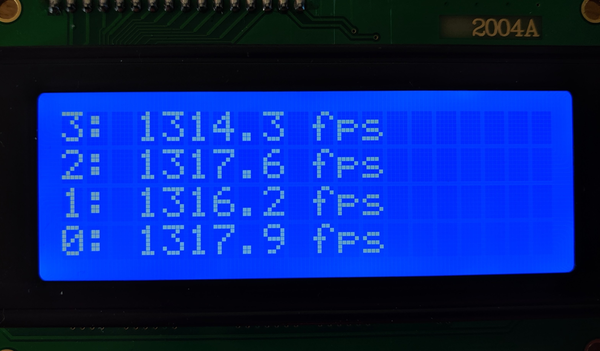

### Table of Contents
* [Senior Design Chronograph - The Passing of the Torch](#senior-design-chronograph---the-passing-of-the-torch)
* [Hardware](#hardware)
    * [STM32F4](#stm32f4)
    * [Prototype Board](#prototype-board)
    * [Digital Board](#digital-board)
* [Development Tools](#development-tools)
    * [IDE](#ide)
    * [DFU Mode](#dfu-mode)
    * [Step-by-Step Guide to Programming With DFU](#step-by-step-guide-to-programming-with-dfu)
        * [Step-by-Step 3-Step Summary](#step-by-step-3-step-summary)
* [Software](#software)
    * [Core Functionality Explained](#core-functionality-explained)
    * [Software Manuals](#software-manuals)
    * [LCD Display](#lcd-display)
        * [LCD Drivers](#lcd-drivers)
        * [LCD Setup](#lcd-setup)
        * [LCD Usage Example](#lcd-usage-example)
    * [Chronograph Struct](#chronograph-struct)
        * [Struct Variable Definitions](#struct-variable-definitions)
* [ISR and System Flow](#isr-and-system-flow)
    * [time_meas function](#time_meas-function)
    * [u_to_str function](#u_to_str-function)
    * [d_to_str function](#d_to_str-function)
    * [ind function](#ind-function)
* [Testing and Validation](#testing-and-validation)

# Senior Design Chronograph - The Passing of the Torch
This is the documentation for the software for senior design project for the
measurement of the speed of small caliber projectiles. This software is written
for an STM32F4 microcontroller that is the at the core of our system -- a three
gate laser plane chronograph. 

_**Note:** Most of the links provided in this documentation are not just
relevant tangents, but meant to be consumed inline or at minimum referenced
later on._

# Hardware
## STM32F4
The 32-bit MCU being used for this project is the [STM32F405RGT][STM32F405RGT].
That link has good information about the device, but the primary reason it was
selected was due to its speed. The [datasheet][MCU Datasheet] has better
information than ST's marketing material. This processor has way more
peripherals and processing power than we need, but it was an incredibly cheap
option to get very fast timing capabilities into our project.

## Prototype Board
The prototype board is a [STM32F4Stamp][STM432F4Stamp] designed by Frank Zhao.
EagleCAD files were provided, which I used to generate gerbers and order the
boards from OSH Park. I ordered all the parts from Digi-key, and assembled two
boards. This prototype is breadboard compatible and has all of the pins exposed
so software was able to be tested throughout the other designs. All of the
development done so far was using this board.

_**Note:** One of the protoype boards does not work. It seems like it does, and
will succesfully connect and flash, but it will not do what you program it to
do. I'm not sure what is wrong with it, bonus points if you figure it out. I
spent many many hours thinking there were software errors before trying the
other board and having it work right away._

## Digital Board
This board builds from the prototype board and connectorizes all of the pins we
need and adds SMPS and battery management. It doesn't make much sense for me to
describe this board any further, just go ahead and look at the [Digital Design
Files][DigDesignFiles] included in the repo. CAD work was done using EasyEDA,
as it has integrated collaboration that is very handy for group board designs.

This documentation is primarily focused on software so I won't dive into this
too heavily here. I also won't dive in because I never actually was able to be
hands on with this board or test it due to the coronavirus, and am not sure
what the status of it is at this time.

# Development Tools
ST's [development ecosystem][ST Tools] has become impressive throughout the
years, going from eclipse addons to fully fledged IDE's with automatic code
generation capabilities from GUI peripheral setup and impressive graphical
clock management systems. This available tooling also contributed to it being
selected over alternative MCUs.

## IDE
For building the project I used the [STM32CubeIDE][STM32CubeIDE]. This IDE
doesn't need to be used, but it nicely integrated with
[STM32CubeMX][STM32CubeMX] for peripheral setup. There are many compilers that
could be used instead using the same project files, some good alternatives are
[Keil][Keil] or the [arm-gcc toolchain][ARM GCC].

Peripheral code generation can save you some time reading the [STM32 HAL
Manual][STM32 HAL Manual], but take a look at [CubeMX Manual][CubeMX Manual] to
see for yourself.


## DFU Mode
**DFU** is [Device Firmware Upgrade][DFU AN], and is a USB protocol implemented
in many STM32 devices that essentially makes the microcontroller USB
programmable without any other ICs needed. It is a boot mode built into the
device that is permanent, and can be easily accessed and programmed using ST
provided tools. This [DFU User Manual][DFU UM] has all the information you need
to know to interact with the GUI and successfully flash a the device. 

DFU Mode is entered by holding a specific pin while booting, which is done with
the **BOOT** button on our devices. There are multiple ways to enter DFU Mode:
* Hold the **BOOT** button and then plug in the USB cable
* When already plugged in, hold the **BOOT** button and press the **RST**
  button

## Step-by-Step Guide to Programming With DFU 

1. If you haven't already, download and install the [DfuSe Demo][DfuSe]
   software package from ST. This package includes the programs **DfuSeDemo**
   and **DFU file manager**.

1. Compile the project using STM32CubeIDE with the `Build All` command, or with
   your IDE of choice and the associated method.

2. Run **DFU file manager** and use it to convert the `Chrono.hex` file
   in `SrDesignChrono/Debug/` into `Chrono.dfu`. I save this file in the same
   directory, but it doesn't need to be. [More details here if
   needed][DFU UM]

3. Plug in the microcontroller and enter DFU Mode one of two ways:
    * Hold the **BOOT** button and then plug in the USB cable
    * When already plugged in, hold the **BOOT** button and press the **RST**
      button

4. Open **DfuSeDemo**.

5. Select the device from the list in the _Available DFU and compatible HID
   Devices_ section. [More details here if needed][DFU UM]

6. Select the **Choose** button from the _Upgrade or Verify Action_ section and
   select the `Chrono.dfu` file generated earlier. 

7. Select the **Upgrade** button, wait until the device is done upgrading and
   then press the **RST** button to exit DFU mode.

### Step-by-Step 3-Step Summary

1. Compile C project to `.hex` with **STM32CubeIDE**
2. Convert `.hex` to `.dfu` with **DFU file manager**
3. Flash `.dfu` to device with **DfuSeDemo**


# Software
After much deliberation and time and effort poored into CMSIS drivers, I
succumbed to using ST's HAL drivers for this project.

## Core Functionality Explained
The core functionality of this project is done. When setup, assuming the gates
trigger the way they should, projectiles passing through those gates should
prompt the display to show a new FPS reading of the velocity of that
projectile.

The software is entirely interrupt driven. Right now there are 3 interrupts
setup, one for each gate. When a gate fires, it reads the timer and then waits
for another another interrupt. If no interrupt comes within 100 milliseconds,
the `process_reading` is called which calculates the velocity of the projectile
based on the timer values read in from the interrupts, and the new reading is
displayed to the user and stored in history. 

I will go over this code in more detail below.

## Software Manuals
The [STM32F405 Reference Manual][STM32F405 RM] is the most important document
to become proficient with for development on this project, closely followed by
the [STM32 HAL Manual][STM32 HAL Manual].

It is arduous task. There is a lot there to chew on, and if you've never worked
on something like this before it can be overhwhelming (or at least it was for
me). I highly recommend reading the introductory information for each session
and learning how to navigate the PDF using the bookmarks that are provided for
each section. Even google chrome can navigate using these bookmarks, but they
are best leveraged using something like Adobe Reader (which is also faster and
uses less memory).

If you do become familiar with these, put it on your resume. STM32s are used
everywhere because of how powerful and cheap they are, and if you are
interested in embedded software in the future this is a great skillset to have.

The [STM32 Cortex-M4 Programming Manual][M4 PM] is useful for lower level
information, but I doubt it will be needed much for this project.

There are lots of other ST documents available about specific peripherals and
implementations, but most of them are just abstractions of information in these
manuals available. You realistically should not need any information outside of
the links provided in this section.

## LCD Display
The LCD is a 20 by 4 character display. Here is the
[closest thing I could find to a datasheet][sunfound-i2c-wiki]. It isn't the
most helpful page, but I was able to extract the information I needed the
Liquid Crystal Arduino library they reference. Unfortunately, the library is
written in object-oriented C++, so besides the bytes needed for setup commands
I wasn't able to use much of it. 

### LCD Drivers
These are the drivers I wrote, and they seem to be working fully in the testing
I did. The functions directly used are `lcd_put_cur` to set the cursor position
and `lcd_send_string` to write a string out to the display at the cursor
position. **Note:** any writing to the display advances the
cursor position.

```c
// Each byte of data is actually sent in 4 bytes to instruct the display on how
// to interpret the data over its 4 data lines
void lcd_send_cmd (uint8_t cmd)
{
    uint8_t data_u, data_l;
	uint8_t data_t[4];
	data_u = (cmd & 0xf0);
	data_l = ((cmd << 4) & 0xf0);
	data_t[0] = data_u | 0x0C;  //en=1, rs=0
	data_t[1] = data_u | 0x08;  //en=0, rs=0
	data_t[2] = data_l | 0x0C;  //en=1, rs=0
	data_t[3] = data_l | 0x08;  //en=0, rs=0
	HAL_I2C_Master_Transmit(&hi2c1, SLAVE_ADDRESS_LCD, (uint8_t *) data_t, 4, 100);
}

// Almost the same as send command, but instructs the display to write directly
// to the correct positions register and display the character
void lcd_send_data (uint8_t data)
{
	uint8_t data_u, data_l;
	uint8_t data_t[4];
	data_u = (data & 0xf0);
	data_l = ((data << 4) & 0xf0);
	data_t[0] = data_u | 0x0D;  //en=1, rs=0
	data_t[1] = data_u | 0x09;  //en=0, rs=0
	data_t[2] = data_l | 0x0D;  //en=1, rs=0
	data_t[3] = data_l | 0x09;  //en=0, rs=0
	HAL_I2C_Master_Transmit (&hi2c1, SLAVE_ADDRESS_LCD, (uint8_t *) data_t, 4, 100);
}

// Go to the first address, then write spaces to all of the registers
void lcd_clear (void)
{
	lcd_send_cmd (0x80);
	for (int i = 0; i < 80; i++)
	{
		lcd_send_data (' ');
	}
}

// Set the cursor to any row, col on the display for writing (the cursor is not
// visible with how I have the display set up)
void lcd_put_cur(uint8_t row, uint8_t col)
{
    switch (row)
    {
        case 0:
            col = 0x80 | (0x80 + col);
            break;
        case 1:
            col = 0x80 | (0x40 + col);
            break;
        case 2:
            col = 0x80 | (0x14 + col);
            break;
        case 3:
            col = 0x80 | (0x54 + col);
            break;
    }

    lcd_send_cmd (col);
}

// Send many characters to the display and increment address
void lcd_send_string (char *str)
{
	while (*str) lcd_send_data (*str++);
}
```

### LCD Setup
The LCD is setup to not display the cursor, and the rest is just necessary
setup for the i2c contoller. `lcd_init` is called in main along side the other
system init functions that run on startup.  

```c
void lcd_init (void)
{
	// 4 bit initialisation
	HAL_Delay(50);  // wait for >40ms
	lcd_send_cmd (0x30);
	HAL_Delay(5);  // wait for >4.1ms
	lcd_send_cmd (0x30);
	HAL_Delay(1);  // wait for >100us
	lcd_send_cmd (0x30);
	HAL_Delay(10);
	lcd_send_cmd (0x20);  // 4bit mode
	HAL_Delay(10);

    // display initialisation
	lcd_send_cmd (0x28); // Function set --> DL=0 (4 bit mode), N = 1 (2 line display) F = 0 (5x8 characters)
	HAL_Delay(1);
	lcd_send_cmd (0x08); //Display on/off control --> D=0,C=0, B=0  ---> display off
	HAL_Delay(1);
	lcd_send_cmd (0x01);  // clear display
	HAL_Delay(1);
	HAL_Delay(1);
	lcd_send_cmd (0x06); //Entry mode set --> I/D = 1 (increment cursor) & S = 0 (no shift)
	HAL_Delay(1);
	lcd_send_cmd (0x0C); //Display on/off control --> D = 1, C and B = 0. (Cursor and blink, last two bits)
}
```


### LCD Usage Example
Here is an example of using the lcd display to fill the screen with relevant
information:

```c
lcd_put_cur(0,0);
lcd_send_string("3: 1314.3 fps");

lcd_put_cur(1,0);
lcd_send_string("2: 1317.6 fps");

lcd_put_cur(2,0);
lcd_send_string("1: 1316.2 fps");

lcd_put_cur(3,0);
lcd_send_string("0: 1317.9 fps");
```




## Chronograph Struct

This struct is used to store all of the information about the chronograph's
current state. 

```c
typedef struct Chronograph {
    uint8_t h_index; // History index (for storage index)
    uint8_t v_index; // View index (for user scrolling)

    char history[H_SIZE][10];

    uint32_t gate_1_time;
    uint32_t gate_2_time;
    uint32_t gate_3_time;
    uint8_t reading; // Reading flag set by gates
} chronograph;
```

### Struct Variable Definitions

<dl>
  <dt>h_index</dt>
  <dd>This is the index of the current value in history. At any time,
  <code>history[Chronograph.h_index]</code> is the most recent measured
  velocity data.</dd>
  <br>
  <dt>v_index</dt>
  <dd>This is the index of the current value displayed on the screen. This is
  used for user scrolling of historical data to see beyond the last 4
  measurements, up to <code>H_SIZE</code> measurements.</dd>
  <br>
  <dt>history</dt>
  <dd>This array stores the historical readings as formatted strings ready for
  display.</dd>
  <br>
  <dt>gate_#_time</dt>
  <dd>These 3 variables store the timer value at which the gate was triggered, used to calculate the velocity.</dd>
  <br>
  <dt>reading</dt>
  <dd>This is a flag set by gate interrupts that signifies that there is a new
  reading to be processed. It probably doesn't seem like this would be
  necessary given it is an interrupt driven system, but is needed to ensure a
  reading is taken even if the third gate doesn't fire.</dd>
</dl>

# ISR and System Flow

The 3 gates are wired to the NVIC as `EXTI0_IRQHandler`, `EXTI1_IRQHandler`,
and `EXTI2_IRQHandler` located in `stm32f4xx_it.c`. They are all essentially
the same besides the gate number changing.

1. The interrupt flag is cleared to prevent the ISR to be pushed onto the stack
   again.
2. The value in the 32-bit setup as continous upcount `TIM2` is stored into the
   chronograph `gate_#_time`.
3. The chronograph reading flag is set.
4. A 100 ms delay is started, which has the M4 run `NOPS` while waiting for the
   next gate to interrupt.
5. When the delay is over, `process_reading` is called as long as the
   `chrono.reading` flag has not been cleared. This flag is cleared by the
   `process_reading` function, which prevents a single reading from being
   processed multiple times.

```c
void EXTI0_IRQHandler(void)
{
  /* USER CODE BEGIN EXTI0_IRQn 0 */
	// Clear interrupt
	EXTI->PR = 0x0001;
	chrono.gate_1_time = TIM2->CNT;

	chrono.reading = 1;

	HAL_Delay(100);
	if(chrono.reading == 1)
		process_reading(&chrono);

  /* USER CODE END EXTI0_IRQn 0 */
  HAL_GPIO_EXTI_IRQHandler(GPIO_PIN_0);
  /* USER CODE BEGIN EXTI0_IRQn 1 */

  /* USER CODE END EXTI0_IRQn 1 */
}
```

6. The `process_reading` function starts by clearing the `reading` flag.
7. The `time_passed` value is then calculated using the [`time_meas`
   function](#time_meas-function).
8. If a valid value was recorded, the reading is passed into the `new_reading`
   function, after which the gate time values are cleared.

```c
void process_reading(volatile chronograph *chrono)
{
    chrono->reading = 0;

    uint32_t time_passed = time_meas(chrono->gate_1_time, chrono->gate_2_time,
                                        chrono->gate_3_time, &gates);

    if(time_passed == 1)
        error();
    else
        new_reading(time_passed, gates, chrono);

    chrono->gate_1_time = 0;
    chrono->gate_2_time = 0;
    chrono->gate_3_time = 0;
}
```

9. The `new_reading` function first calculates the new fps value measured by
   computing it with (D/12)/(1e6/t).

10. This value is then copied into the `new_read` buffer using the
    [`d_to_str` function](#d_to_str-function).

11. The string `" fps "` is appended to the `new_read` buffer.
12. The string representation of the integer `gates` is appended to the
    `new_read` buffer using the [`u_to_str` function](#u_to_str-function).

```c
void new_reading(const uint32_t time_passed, const uint8_t gates, volatile chronograph *chrono)
{
    char buff[17];
    char new_read[17];
    double fps = 0;

    // FPS calculation
    // (DISTANCE / 12) = feet
    // 1e6 / time_passed = 1/seconds
    fps = ((double)(DISTANCE * 1000000) / (time_passed * 12));

    // Copy new reading into the new_read buffer
    // values stored as formatted strings
    strcpy(new_read, d_to_str(fps, buff+16));
    strcat(new_read, " fps ");
    strcat(new_read, u_to_str(gates, buff+16));
    strcat(new_read, "\0");
    add_history(new_read, chrono);
    display_update(chrono);
}
```

13. Next, `add_history` is called passing the new reading string and the
    chronograph state.
14. The `chrono->h_index` is incremented, and if the history buffer is full it
    is reset to 0 to start overwriting the first data measurements.
15. The new reading is then copied into the new history location.

```c
void add_history(char *new, volatile chronograph *chrono)
{
    // Move index, or reset it to overwrite once history size is full
    if(chrono->h_index == (H_SIZE - 1))
        chrono->h_index = 0;
    else
        chrono->h_index++;

    // Store value in history buffer
    strcpy((char *)chrono->history[chrono->h_index], new);

    // TODO: Write data SD card here
}
```

16. Next, the `display_update` function is called passing the chronograph
    state.
17. Each row of the display is stepped through, and the index value and data is
    written to the display according to the history index and visual index.
18. The data position to display is found with the
    [`ind` function](#ind-function).

```c
void display_update(volatile chronograph *chrono)
{
    char buff[16];

    // Write each history value to the display
    for(int row = 3; row > -1; row--)
    {
        lcd_put_cur(row,0);
        HAL_Delay(5);

        lcd_send_string(u_to_str(3 - row - chrono->v_index, buff + 16));
        lcd_send_string(": ");

        lcd_send_string((char *)chrono->history[ind(row, chrono)]);
    }
}
```

### time_meas function

This function checks which gates fired and calculates the time the projectile
took to travel `DISTANCE` inches in microseconds. The calculation is the simple
average of the two spans if all three gates are fired, otherwise is the
calculated using the two gates that did. If only one gate fired, `1` is
returned, which results in an `error();` in the `process_reading` function.

The `gates` variable is an integer that represents the gates that have fired,
to let the user know if all 3 are not triggering for some reason.

```c
uint32_t time_meas(const uint32_t tim1, const uint32_t tim2,
        const uint32_t tim3, uint8_t *gates)
{
    if(tim1 && tim2 && tim3)
    {
        *gates = 123;
        return ((tim2 - tim1) + (tim3 - tim2))/168;
    }
    else if(tim1 && tim2)
    {
        *gates = 12;
        return (tim2 - tim1)/84;
    }
    else if(tim2 && tim3)
    {
        *gates = 23;
        return (tim3 - tim2)/84;
    }
    else if(tim1 && tim3)
    {
        *gates = 13;
        return (tim3 - tim1)/168;
    }
    return 1;
}
```

### u_to_str function
This function takes in a unsigned integer and the ending byte of a char array
buffer and fills that char buffer with the string representation of the
unsigned integer, then returns the earliest used byte of that buffer as a
pointer.

```c
char *u_to_str(unsigned x, char *s)
{
    *--s = 0;
    if (!x)
        *--s = '0';
    for (; x; x /= 10)
        *--s = '0' + x % 10;
    return s;
}
```

1. Write a terminator to the end of the buffer
2. Decrement the buffer pointer
3. Check if `x` is zero.
    - If `x` is zero, then the function would run like:  
        ```c
        *--s = 0;
        *--s = '0';
        for(; False;)
        return s; // s = "0\0"

        ```
    - If `x` is for example `138`, then the function would run like:  
        ```c
        *--s = 0;
        if(138)         // for(;x;) == if(x)
        {
            *--s = '8'; // *--s = '0' + x % 10;
            x = 13      // x /= 10
        }
        if(13)          // for(;x;) == if(x)
        {
            *--s = '3'; // *--s = '0' + x % 10;
            x = 1       // x /= 10
        }
        if(1)           // for(;x;) == if(x)
        {
            *--s = '1'; // *--s = '0' + x % 10;
            x = 0       // x /= 10
        }
        if(0)           // for(;x;) == if(x)
        return s;       // s = "138\0"
        ```


### d_to_str function
This function takes in a double value and the ending byte of a char array
buffer and fills that char buffer with the string representation of the double,
then returns the earliest used byte of that buffer as a pointer.

This is basically just a modified version of the
[`u_to_str` function](#u_to_str-function) that takes doubles and rounds them to
two decimal places and converts them to integers before using similar logic.

```c
char *d_to_str(double d_x, char *s)
{
    uint32_t x = d_x*100;

    *--s = 0;
    if (!x) {
    	s -= 4;
        strcpy(s, "0.00");
        return s;
    }
    for (int i = 0; i < 2 && x; i++) {
        *--s = '0' + x % 10;
        x /= 10;
    }
    *--s = '.';
    for (; x; x /= 10)
        *--s = '0' + x % 10;
    return s;
}
```

### ind function
This function solves for the current index of the data that needs to be
displayed to the buffer given the current row and stored values in `v_index`
and `h_index`.

```c
int ind(int row, volatile chronograph *chrono)
{
	int ind = chrono->h_index + 3 - row - chrono->v_index;
	while(ind < 0)
		ind++;
	while(ind > H_SIZE)
		ind--;
	return ind;
}
```

# Testing and Validation
I have validated the software work thus far using three digital outputs of an
Arduino to drive the gate inputs in succession as a simulation of a projectile
passing through the chronograph. The timing resolution and digital output speed
on the ATmega328p not fast enough to test precision. My goal was to eventually
do the same testing with the actual digital board of the device, and replace
the Arduino with the current STM32F4 prototype board for it's high speed GPIO
output in place of the Arduino to test the precision and work on calibration.

<!-- Reference Links -->
[STM32F405RGT]: https://www.st.com/en/microcontrollers-microprocessors/stm32f405rg.html
[MCU Datasheet]: https://www.st.com/resource/en/datasheet/dm00037051.pdf

[DigDesignFiles]: https://github.com/MRog40/SrDesignChrono/blob/master/Project_digital_20200420210721.zip
[AnalogDesignFiles]: https://github.com/MRog40/SrDesignChrono/blob/master/Project_sensorboard_20200420210733.zip
[STM432F4Stamp]: https://eleccelerator.com/stm32f4stamp-breakout-board/

[ST Tools]: https://www.st.com/en/development-tools/stm32-software-development-tools.html

[STM32CubeIDE]: https://www.st.com/en/development-tools/stm32cubeide.html
[CubeIDE Quick Start]: https://www.st.com/resource/en/user_manual/dm00598966-stm32cubeide-quick-start-guide-stmicroelectronics.pdf

[Keil]: http://www2.keil.com/mdk5/uvision/
[ARM GCC]: https://developer.arm.com/tools-and-software/open-source-software/developer-tools/gnu-toolchain/gnu-rm

[STM32CubeMX]: https://www.st.com/en/development-tools/stm32cubemx.html
[CubeMX Manual]: https://www.st.com/resource/en/user_manual/dm00104712-stm32cubemx-for-stm32-configuration-and-initialization-c-code-generation-stmicroelectronics.pdf

[DFU AN]: https://www.st.com/resource/en/application_note/cd00264379-usb-dfu-protocol-used-in-the-stm32-bootloader-stmicroelectronics.pdf

[DFU UM]: https://www.st.com/resource/en/user_manual/cd00155676-getting-started-with-dfuse-usb-device-firmware-upgrade-stmicroelectronics-extension-stmicroelectronics.pdf

[DfuSe]: https://www.st.com/en/development-tools/stsw-stm32080.html

[STM32 HAL Manual]: https://www.st.com/resource/en/user_manual/dm00105879-description-of-stm32f4-hal-and-ll-drivers-stmicroelectronics.pdf 

[STM32F405 RM]: https://www.st.com/resource/en/reference_manual/dm00031020-stm32f405-415-stm32f407-417-stm32f427-437-and-stm32f429-439-advanced-arm-based-32-bit-mcus-stmicroelectronics.pdf

[M4 PM]: https://www.st.com/resource/en/programming_manual/dm00046982-stm32-cortex-m4-mcus-and-mpus-programming-manual-stmicroelectronics.pdf

[sunfound-i2c-wiki]: http://wiki.sunfounder.cc/index.php?title=I2C_LCD2004
